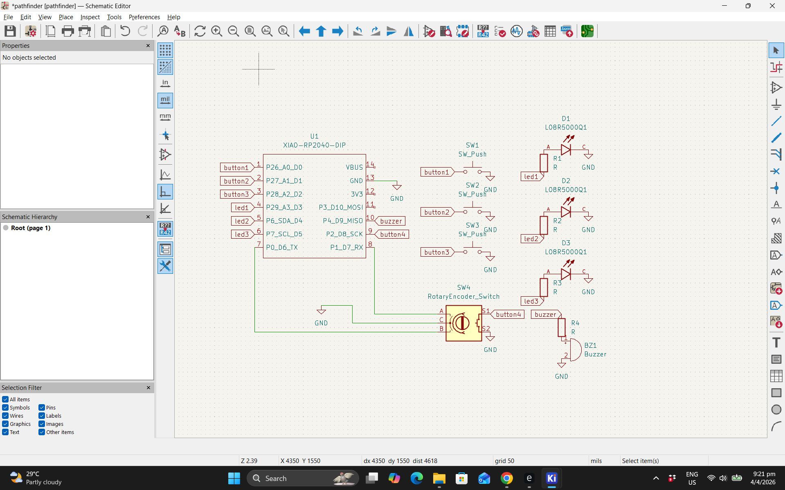
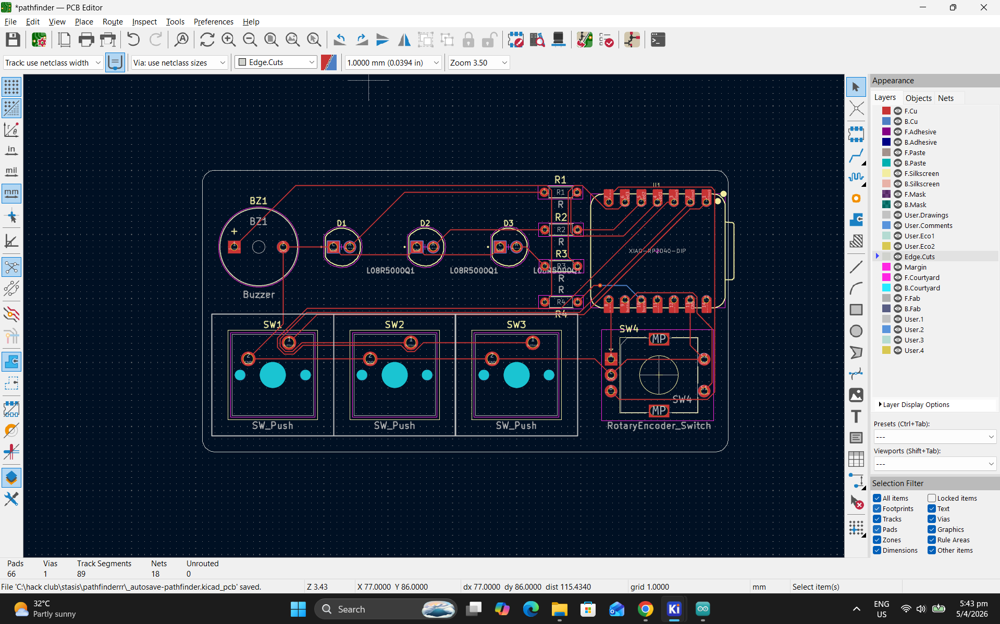
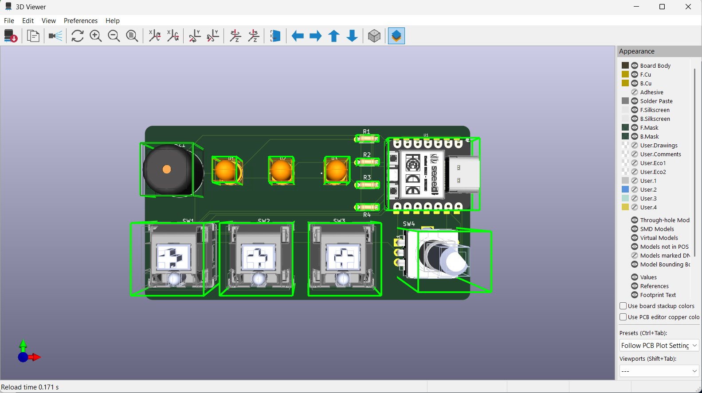
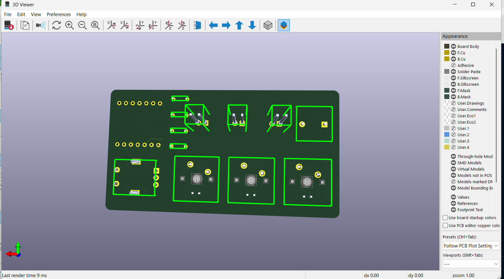
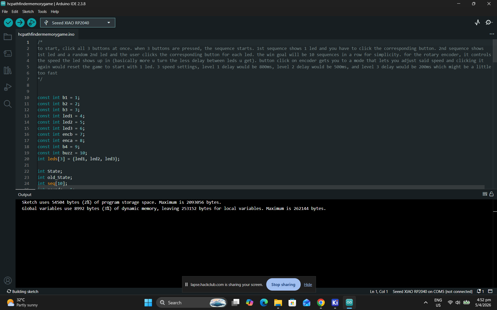

this is (hopefully) a memory game PCB where a random LED will flash and you, the user, are supposed to click the corresponding button to go to the next round.
at the next round, an additional led will light up after the previous led shown are lit, and you are supposed to repeat the pattern up to 10 rounds.
to start the game, you would have to click all 3 buttons at the same time.
the rotary encoder button will change the mode to a settings mode where you can set your difficulty (led 1 = flash for 800ms, led 2 = flash for 500ms and led 3 = flash for 200ms)
a 2nd click will get out of settings mode and restart the game to round 1.

i did this by first, randomly generating a set of 10 numbers, and then if the correct LED is clicked, it will move on to the next.

as for the PCB, I used 3 keyboard switches, an EC11 rotary encoder, a XIAO RP2040, 3 leds, 4 resistors, and a buzzer.
i fillet-ed the edges to a radius of 2mm for it to hopefully be more comfy to hold
the traces could be better but im far too lazy to reroute them after finding out of the existance of a vias far too late into my design

Schematic:

PCB layout:

PCB 3d:

PCB 3d (rear)

Verified Code (no more bugs :D):

i did this in 2 sessions:
Session 1: 1.03h
i only did the PCB and it took longer than 1h but i didnt setup the time thingy correctly

Session 2: 2.42h:
finished the firmware for the project and Verified my code using arduino IDE until i have no more bugs
